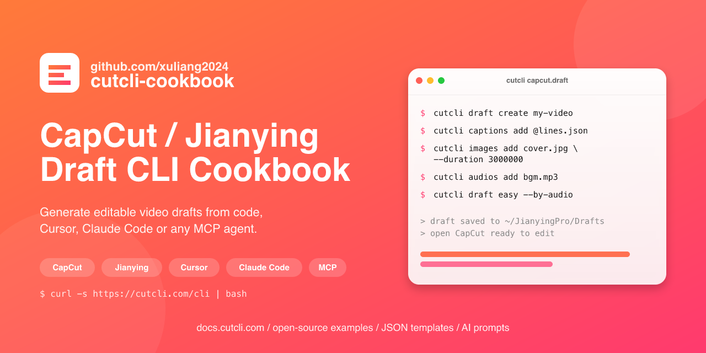

# cutcli-cookbook

> Open-source cookbook, JSON templates, AI prompts, and docs for [cutcli](https://cutcli.com) — the CapCut / Jianying (剪映) draft CLI. Generate editable video drafts from code, Cursor, Claude Code or any MCP agent.

[English](README.md) · [简体中文](README.zh.md)

<p align="center">
  <a href="https://docs.cutcli.com">
    
  </a>
</p>

[](https://docs.cutcli.com)
[](LICENSE)
[](CONTRIBUTING.md)
[](https://github.com/xuliang2024/cutcli-cookbook/stargazers)
[](https://github.com/xuliang2024/cutcli-cookbook/commits/main)
[](prompts/)

cutcli generates standard CapCut / Jianying drafts that the desktop app can open directly. This repo collects ready-to-run examples, reusable JSON templates, AI prompts, and the official documentation source. Contributions welcome.

---

## 30-second start

```bash
# 1. Install cutcli
curl -s https://cutcli.com/cli | bash

# 2. Run the simplest example
git clone https://github.com/xuliang2024/cutcli-cookbook.git
cd cutcli-cookbook/examples/01-hello-caption
bash run.sh

# 3. Open CapCut / Jianying — the new draft is already in the list
```

Full guide: <https://docs.cutcli.com/guide/installation>

## What's inside

| Directory | Purpose |
|---|---|
| [`examples/`](examples/) | One-shot runnable examples (each with `run.sh` + `README.md` + `preview.gif`) |
| [`templates/`](templates/) | Reusable JSON snippets (caption / animation / filter presets) |
| [`prompts/`](prompts/) | Prompts for Cursor / Claude / ChatGPT to drive cutcli |
| [`docs/`](docs/) | VitePress source for docs.cutcli.com |
| [`showcase/`](showcase/) | Monthly community showcase |
| [`worker/`](worker/) | Cloudflare Worker (R2 reverse proxy with SPA fallback) |

## Featured P0 examples

| Example | Demo | Length |
|---|---|---|
| [01-hello-caption](examples/01-hello-caption/) | One caption + entrance animation | 5 s |
| [02-image-slideshow-bgm](examples/02-image-slideshow-bgm/) | 3-image slideshow + transitions + BGM | 9 s |
| [03-tiktok-keyword-highlight](examples/03-tiktok-keyword-highlight/) | Multiple captions with keyword highlight | 6 s |
| [04-easy-by-audio](examples/04-easy-by-audio/) | `cutcli draft easy` auto-fits to audio | adaptive |
| [05-keyframe-zoom-in](examples/05-keyframe-zoom-in/) | Image + keyframe zoom | 5 s |

## FAQ

### What is cutcli?

cutcli is a single-binary command-line tool that turns shell commands or JSON into a standard **CapCut / Jianying (剪映) draft folder**. Open CapCut on desktop and the draft is already in your draft list — fully editable, with captions, animations, transitions, audio and keyframes intact. No reverse-engineered file format, no manual JSON patching.

Install: `curl -s https://cutcli.com/cli | bash`

### What's in this cookbook?

- [`examples/`](examples/) — copy-paste runnable cases (one caption, image slideshow, TikTok keyword highlight, audio-driven layout, keyframe zoom)
- [`templates/`](templates/) — reusable JSON snippets for captions / animations / filters
- [`prompts/`](prompts/) — system prompts for Cursor, Claude Code, ChatGPT and MCP agents to drive cutcli
- [`docs/`](docs/) — VitePress source for [docs.cutcli.com](https://docs.cutcli.com)
- [`worker/`](worker/) — Cloudflare Worker (R2 reverse proxy + SPA fallback) that powers the docs site

### How do I use cutcli with Cursor, Claude Code or an MCP agent?

cutcli is just a shell command, so any AI coding agent can drive it. We ship ready-made system prompts in [`prompts/`](prompts/) — drop them into your agent and ask things like *"add a 3-second caption that fades in at 1s"* or *"build a 9-second slideshow from these three images with BGM"*. The agent emits `cutcli ...` calls and you get a CapCut draft. See the integration guide at <https://docs.cutcli.com/guide/ai-integration>.

### Does cutcli work with both CapCut (international) and Jianying (剪映 Chinese)?

Yes. The draft format is the same on both apps; cutcli writes drafts that either client can open directly from its draft folder.

### How is this different from manually editing CapCut JSON?

Hand-writing CapCut draft JSON means dealing with microsecond timestamps, undocumented enums, normalized 0–1 coordinates and a half-dozen sibling files that must stay in sync. cutcli handles all of that and exposes a stable CLI surface (`cutcli draft create`, `cutcli captions add`, `cutcli draft easy`, …) that survives CapCut version bumps. Same reason people use FFmpeg instead of writing MP4 boxes by hand.

## Contributing

We welcome every kind of contribution:

- Add a new example (easiest — copy a folder and edit, no setup required)
- Translate or improve docs
- Fix a bug
- Submit your work to `showcase/`

See [CONTRIBUTING.md](CONTRIBUTING.md).

## Links

- Website: <https://cutcli.com>
- Docs: <https://docs.cutcli.com>
- Install: `curl -s https://cutcli.com/cli | bash`
- Discussion: [Issues](https://github.com/xuliang2024/cutcli-cookbook/issues) / [Discussions](https://github.com/xuliang2024/cutcli-cookbook/discussions)

## License

[MIT](LICENSE) © 2026 m007 and cutcli-cookbook contributors
